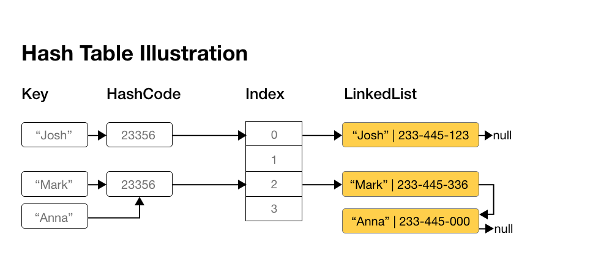
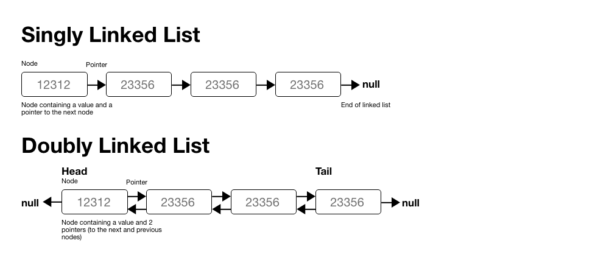

# Algorithms and Data Structures - Java 👨🏻‍💻

All problems and content are from Cracking the Coding Interview Book by Gayle Laakmann McDowell

## Problems and Solutions are [here](./problems)

## 1. Arrays and Strings

### 1.1 Hash Tables

#### Abstractions

Hash tables is a data structure that maps keys to values for highly efficiency lookup. There are many ways if implementing this.

In a simple implementation you would use an array of linked lists. To insert a key and value we follow the following steps:

1. Compute the hash code for the key, which will usually be an `int` or `long`. Not that different <b>keys might have the same hash code</b>.

2. Map the hash code to an index in the array. This could be done using something like `hash(key) % array_length`. Two different hash codes <b>could map to the same index</b>.

3. At this index,there is a linked list of keys and values. Store the key and value in this index. We must use a linked list because of collisions.

To retrieve the value by its pair key, we repeat this process.Compute the hash code from the key, and then compute the index from the hash code. Then search through the linked list for the value with this key.

Summary

`key` -> `hashCode` -> `index` -> `(key, value)`



#### Complexity

If the number of collisions is very high, the worst case is **O(n)**, where **n** is the number of keys. However, generally we assume we have a good implementation of the hash function and collision is minimized, therefore the lookup worst time is **O(1)** (constant).

Another way we can implement the hash table is with a balanced BST(Binary Search Tree). This gives us an **O(log n)** lookup time. We can also iterate through the keys in order, which can be useful sometimes.

##### Notes

Hashing ins not encryption! Hashing is not reversible.

### Implementation is Java

To store (key, value) pairs in Java we use a Map. These are based on the Hash Table data structure. (There are many more, but I just included the most useful)

| Name    | Get / Put / Remove / Contains Key | Ordering                 |
| ------- | --------------------------------- | ------------------------ |
| HashMap | `O(1)`                            | not guaranteed           |
| TreeMap | `O(1)`                            | sorted, natural ordering |

---

### 1.2 Arrays and Resizable Arrays

#### Abstractions

The main difference between arrays and list is that arrays are fixed in size, while lists can grow as much as we want. When you need an array-like data structure that offers dynamic resizing you'd often use `ArrayList` in Java.

ArrayList is an array that resizes itself when needed and keeps constant **O(n)** time for access. In a typical implementation, when the array is full it doubles its size. Each time it doubles, it takes **O(n)** time but it happens really rarely and therefore the insertion is amortized to **O(1)** (constant time).

**Explanation for the amortized O(1)**
Let's say we have an array with length n. We can work backwards computing how many elements we copied each time we increased the capacity.

- 1st capacity increase : 1 element
- 2nd capacity increase : 2 elements
- ...
- previous capacity increase : n/8
- previous capacity increase : n/4
- final capacity increase : n/2

So the total number of copies to insert n elements, is ~ `n/2 + n/4 + n/8 + ... + 2 + 1` < `n`

Therefore inserting n elements takes **O(n)**. Each insertion takes **O(1)** on average, even tough some insertions take **O(n)** time in the worse case.

A good analogy is to think about a path you have to walk to get to the store = 1 km. You first walk 0.5 km, and then 0.25km and then 0.125km and so on. At the end you'll never walk 1km, but you'll get very close to it.

#### Implementation in Java

| Operation | ArrayList | Array  |
| --------- | --------- | ------ |
| get       | `O(1)`    | `O(1)` |
| add       | `O(n)`    | `O(n)` |
| remove    | `O(n)`    | `O(n)` |

---

### 1.3 StringBuilder

#### Abstractions

The `StringBuilder` in Java represents a mutable sequence of characters. Since the `String` Class in Java creates an **immutable** sequence of characters, the `StringBuilder` class provides an alternative to String Class, as it creates a mutable sequence of characters.

To illustrate why StringBuilder is good, let's look at an example.

Create a single string composed of strings from an array of strings. Think about creating a sentence from multiple words. We assume all words have same length k, and there are n string. If we run the following code:

```java
String joinWords(String[] words) {
    String sentence = "";
    for (String w: words) {
        sentence = sentence + w;
    }
    return sentence;
}
```

The time complexity will be `O(k + 2k + ... + nk)` = **O(k _ (n _ (n+1) / 2))** = **O(k \* n<sup>2</sup>)**

Using the same algorithm but replacing String with StringBuilder makes a big difference.

```java
String joinWords(String[] words) {
    StringBuilder sentence new StringBuilder();
    for (String w : words) {
        sentence.append(w);
    }
    return sentence.toString();
}
```

Time complexity is **O(n)** where n is the nb. of words.

## 2. Linked Lists

A linked list is a data structure that represents a sequence of nodes. In a singly linked list each node has a pointer to the next node and in a doubly linked list each node has two pointers, one pointing to the next element, and one to the previous

Unlike an array, a linked list does not provide constant time access to an "index" within the list. This means that if you want to get the kth element in the list you'd have to iterate through k elements in the list.

In a linked list you can add elements at the beginning and end of the list in constant time which in some cases is really useful.



### Creating a Linked List

This implementation is not a Linked List data structure. We access the linked list through a reference to the head Node of the linked list. When implementing the list in this way we need to be careful if multiple objects reference to this list. If the head changes, some objects might still point to the old head.

To fix this, we would have another class LinkedList which as a property head in which we store the head of the list.

```java
class Node{
    Node next = null;
    int data;

    public Node(int d) {
        data = d;
    }

    void appendToTail(int d) {
        Node end = new Node(d);
        Node n = this;
        while (n.next != null) {
            n = n.next;
        }
        n.next= end;
    }
}
```

### Deleting a node from a Singly Linked List

Given a node `n`, we find the previous node `prev` and set `prev.next = n.next`. If we have doubly linked list we also must set `n.next.prev = n.prev`. We also have to check for the null pointers and update the head / tail accordingly.

```java
Node deleteNode(Node head, int d) {
    Node n = head;
    if(n.data = d) {
        return head.next; // move head
    }

    while(n.next != null) {
        if (n.next.data = d) {
            n.next = n.next.next;
            return head;
        }
        n = n.next;
    }
    return head;
}
```

### The "Runner" Technique

The "**Runner**" or the second pointer technique means that you iterate through the linked list with two pointers at the same time, with one ahead of the other. The **fast** node might be ahead by a fixed amount, or it might be jumping multiple nodes for each one node that the **slow** pointer iterates through.

Example: Assume you have a list _a<sub>1</sub> -> a<sub>2</sub> -> a<sub>3</sub> -> ... -> a<sub>n</sub> -> b<sub>1</sub> -> b<sub>2</sub> -> b<sub>3</sub> -> ... -> b<sub>n</sub>_ and you wanted to rearrange it to _a<sub>1</sub> -> b<sub>1</sub> -> ... -> a<sub>n</sub> -> b<sub>n</sub>_. You do not know the length of the list but you know that the length is an even number.

You could have a pointer `p1` (the **fast** pointer) move every two elements for every one move that `p2` does. When `p1` hits the end of the list, `p2` will be halfway through, then move `p1` back to the front, and start "waving" elements. On each iteration, `p2` selects and element and inserts it after `p1`.

### Recursive Problems

A number of linked list problems rely on recursion. If you're having trouble solving a linked list problem, you should explore if a recursive approach will work. **However, you should remember that recursive algorithms take at least O(n) space**, where n is the depth of the recursive call. All recursive algorithms can be implemented iteratively, although they may be much more complex.

### Time complexity

| Operation              | Linked List | Doubly Linked List |
| ---------------------- | ----------- | ------------------ |
| get                    | `O(n)`      | `O(n)`             |
| add(tail or head)      | `O(1)`      | `O(1)`             |
| remove(tail or head)   | `O(1)`      | `O(1)`             |
| add and remove(inside) | `O(n)`      | `O(n)`             |

## 3. Stacks and Queues

Much easier to handle if you understand how they work. Problems can be tricky though.

### Implementing a Stack

The definition of a stack is precisely what it's sounds like, a stack of data. In certain problems it's more favorable to store the data in this fashion. Stack uses **LIFO ordering (Last In First Out)**. That is, as in a stack of plates, the most recent item added to the stack is the first item to be removed.

**Methods**
`pop()`: Remove the top item from the stack.
`push(item)`: Add an item to the top of the stack.
`peek()`: Return the top of the stack.
`isEmpty()`: Return true if and only if the stack is empty.

Stack doesn't provide constant-time access to the i<sub>th</sub> element. However it does provide constant time for adding and removing.

### Java Implementation

```java
public class MyStack<T> {
    private static class StackNode<T> {
        private T data;
        private StackNode<T> next;

        public StackNode(T data) {
            this.data = data;
        }
    }

    private StackNode<T> top;

    public T pop() {
        if (top == null) throw new EmptystackException();
        T item = top.data;
        top = top.next;
        return item;
    }

    public void push(T item) {
        StackNode<T> t = new StackNode<T>(item);
        t.next = top;
        top = t;
    }

    public T peek() {
        if (top== null) throw new EmptyStackException();
        return top.data;
    }

    public boolean isEmpty() {
        return top == null;
    }
}
```

| Operation                | Stack  |
| ------------------------ | ------ |
| pop                      | `O(1)` |
| push                     | `O(1)` |
| peek                     | `O(1)` |
| find i<sub>th</sub> elem | `O(n)` |

A stack can also be used to implement a recursive algorithm iteratively. (This is a good exercise! Take a simple recursive algorithm and implement it iteratively.)

### Implementing a Queue

A queue is similar to a stack but the ordering is different. A queue implements **FIFO ordering (First In First Out)** hence the name 'queue'. As in a line or queue at a ticket stand, items are removed from the data structure in the same order that they are added

**Methods**
`add()`: Add an item to the end of the list.
`remove()`: Remove the first item in the list.
`peek()`: Return the top of the queue.
`isEmpty()`: Return true if and only if the queue is empty.

### Java Implementation

```java
public class MyQueue<T> {
    private static class QueueNode<T> {
        private T data;
        private QueueNode<T> next;

        public QueueNode(T data) {
            this.data = data;
        }
    }

    private QueueNode<T> first;
    private QueueNode<T> last;

    public void add(T item) {
        QueueNode<T> t = new QueueNode<T>(item);
        if (last != null) {
            last.next = t;
        }
        last = t;
        if (first == null) {
            first = last;
        }
    }

    public T remove() {
        if (first== null) throw new NoSuchElementException();
        T data = first.data;
        first = first.next;

        if (first == null) {
            last = null;
        }
        return data;

    }

    public T peek() {
        if (first == null) throw new EmptyQueueException();
        return first.data;
    }

    public boolean isEmpty() {
        return first == null;
    }
```

One place where queues are often used is in **breadth-first search** or in implementing a **cache**.
